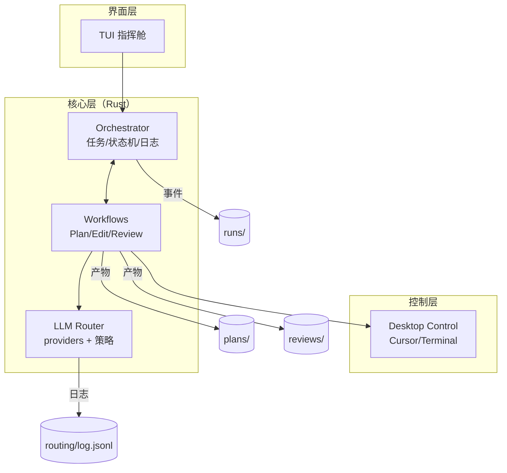

# DeskAgent v1.0（Rust）

桌面 AI 助理的最小可运行闭环：以 Rust 为内核，统一编排任务（Plan → Edit → Review），通过 LLM 路由生成计划与审查结果，驱动本地 Cursor 与 Terminal 执行修改，并以 TUI 呈现状态与操作入口。

---

## 特性概览
- **编排内核 Orchestrator（Rust）**：任务/状态机、事件日志、重试与超时、并发调度
- **桌面控制 Desktop Control**：
  - Cursor IDE：打开文件、定位到行列、插入文本、保存
  - Terminal：执行命令，捕获标准输出/错误与退出码
- **LLM Router**：支持多提供方接入（如 Claude、OpenRouter），按任务类型路由模型
- **TUI 指挥舱**：仓库与分支信息、最近任务、快捷键入口与二次确认
- **工作流 Workflows**：PLAN 生成计划、EDIT 执行占位编辑、REVIEW 汇总信号生成审查摘要
- **可观测性与产物**：plans/、reviews/、runs/、status/、routing/ 等目录产物落盘

---

## 架构总览


---

## 目录结构
```text
.
├── Cargo.toml
├── README.md
├── config.yaml                # 可选：运行时配置
├── sprint.md                  # Sprint 拆解与 DoD
├── src/
│   ├── main.rs                # 入口：初始化日志/配置 → 启动 TUI
│   ├── lib.rs                 # crate 公共导出（若有）
│   ├── orchestrator/          # 编排内核：状态、任务、事件日志
│   ├── desktop/               # 桌面控制：cursor.rs、terminal.rs
│   ├── llm/                   # LLM 路由与 provider（占位或实现）
│   ├── tui/                   # ratatui + crossterm 的 TUI
│   └── workflows/             # Plan/Edit/Review 工作流
├── examples/
│   └── workflow_demo.rs       # 演示：PLAN → EDIT → REVIEW
├── plans/                     # 计划产物（运行后生成）
├── reviews/                   # 审查产物（运行后生成）
├── runs/                      # 运行日志（运行后生成）
├── routing/                   # LLM 路由日志（运行后生成）
├── status/                    # 报告与进度
└── tests/                     # 单测/集成测试
```

---

## 快速开始

### 1) 运行环境
- macOS（推荐，已实现 AppleScript 聚焦/输入/保存）
- Rust 1.74+，tokio async 运行时
- 安装并可通过命令行调用 `cursor`（Cursor IDE CLI）
- 允许 `osascript` 控制应用（系统偏好设置 → 隐私与安全 → 辅助功能）

### 2) 构建与运行
```bash
# 克隆并进入项目
cd /Users/zhaoleon/Documents/M5

# 构建
cargo build

# 运行（启动 TUI）
RUST_LOG=info cargo run
```

启动后，TUI 会显示仓库与最近任务；可通过快捷键触发操作（见下文）。

### 3) 示例：演示工作流
```bash
# 运行例子（需 examples/workflow_demo.rs）
cargo run --example workflow_demo
```

---

## 配置
可通过环境变量 `CONFIG_PATH` 指定配置文件路径（默认 `config.yaml`）。

```bash
export CONFIG_PATH=./config.yaml
RUST_LOG=info cargo run
```

示例 `config.yaml`：
```yaml
llm:
  providers:
    - name: claude
      api_key_env: CLAUDE_API_KEY
      timeout_ms: 30000
    - name: openrouter
      api_key_env: OPENROUTER_API_KEY
      timeout_ms: 30000
  routing:
    plan:
      provider: claude
      model: claude-3-5-sonnet
    review:
      provider: openrouter
      model: gpt-4o
orchestrator:
  max_concurrent_tasks: 5
  task_timeout_ms: 30000
  log_directory: runs
```

设置密钥（示例）：
```bash
export CLAUDE_API_KEY=sk-...
export OPENROUTER_API_KEY=sk-...
```

---

## 模块说明

### Orchestrator（`src/orchestrator/`）
- 统一管理 `PLAN/REVIEW/STATUS/FOLLOWUP/APPLY` 等任务类型与生命周期
- 维护任务 Map、状态存储、事件日志，提供提交与查询接口
- 通过 `tokio::mpsc` 协调任务执行，落盘至 `runs/`

```rust
// 入口初始化（节选）
#[tokio::main]
async fn main() -> anyhow::Result<()> {
    env_logger::init();
    let config = deskagent::orchestrator::OrchestratorConfig::default();
    let orchestrator = deskagent::orchestrator::Orchestrator::new(config).await?;
    let mut app = deskagent::tui::App::new(orchestrator);
    app.run().await?;
    Ok(())
}
```

### Desktop Control（`src/desktop/`）
- `cursor.rs`：打开 Cursor、定位行列、键入文本、保存（macOS 使用 AppleScript 聚焦与输入）
- `terminal.rs`：执行命令，流式读取 stdout/stderr，返回退出码与耗时

```rust
// 在 Cursor 中插入文本并保存（节选）
let cursor = CursorController::new();
cursor.open_cursor(Some(FilePosition { file_path: "README.md".into(), line: Some(1), column: Some(1) })).await?;
cursor.insert_text_at_cursor("Hello from DeskAgent").await?;
cursor.save_file().await?;
```

### LLM Router（`src/llm/`）
- provider 抽象与 API 鉴权、超时与重试
- 任务类型到模型策略映射（如 PLAN/REVIEW 选择不同 provider+model）
- 记录 `routing/log.jsonl` 以便成本与时延分析

### TUI 指挥舱（`src/tui/`）
- ratatui + crossterm 构建：显示仓库信息、最近任务、状态与快捷键
- 快捷键（示例）：
  - `P`：Plan
  - `R`：Review
  - `S`：Status
  - `F`：Follow-up
  - `A`：Apply（入口占位）

### Workflows（`src/workflows/`）
- `PlanWorkflow`：读取 `sprint.md`，生成 `plans/sprint-01.plan.json`
- `EditWorkflow`：根据计划对目标文件执行占位写入（可记录回滚信息）
- `ReviewWorkflow`：汇总 `git diff + lint + test` 等信号，产出 `reviews/AI_REVIEW.md`

---

## 运行产物
- `plans/sprint-01.plan.json`：结构化任务计划
- `reviews/AI_REVIEW.md`：审查报告与建议
- `runs/<ts>/run.json`：任务与事件流水
- `routing/log.jsonl`：LLM 调用记录（模型、耗时、成本、退避）
- `status/REPORT.md`：阶段性汇总报告

---

## 开发与测试

### 本地开发
```bash
# 常用命令
cargo fmt
cargo clippy --all-targets -- -D warnings
cargo test
RUST_LOG=debug cargo run
```

### 集成测试（示例）
```bash
# 端到端：演示 Plan → Edit → Review
cargo run --example workflow_demo

# 或直接运行集成测试
cargo test --test workflow_integration
```

### 代码风格
- Rust 2021，显式错误处理（anyhow/thiserror）
- 命名清晰可读，避免 1-2 字母缩写
- 控制流以卫语句优先，减少深层嵌套

---

## 开发方向（Roadmap）
- 完善任务执行器：落地运行中/暂停/恢复/取消的实际调度与回放
- LLM 路由策略配置化：按任务类型、成本/时延动态选择与降级
- 提升 Desktop Control 稳定性：焦点校验、重试/回退、跨平台（Linux/Windows）
- 丰富 REVIEW 信号：lint/test/coverage 收集与摘要生成
- 加强可观测性：更完备的结构化日志、指标与追踪
- GUI 版本探索：Tauri + egui 的桌面应用形态

---

## 常见问题（FAQ）
- Q：Cursor 命令不可用？
  - A：确认已安装 Cursor，并可在 Shell 中直接运行 `cursor`。必要时将其 CLI 路径加入 `PATH`。
- Q：AppleScript 无法输入？
  - A：在系统偏好设置中授予 Terminal/iTerm/IDE 的“辅助功能”权限；重启后重试。
- Q：无网络或无 API Key？
  - A：LLM 路由可提供离线/占位模式（按 `config.yaml` 配置）。

---

## 许可证
如无特殊声明，代码以 Apache-2.0 或 MIT 的常见开源许可之一发布（请按项目要求更新）。

---

## 致谢
- Rust 社区与 tokio 生态
- ratatui/crossterm
- Cursor 团队
- 各 LLM 提供方

---

若需快速上手，可直接运行：
```bash
RUST_LOG=info cargo run
```
